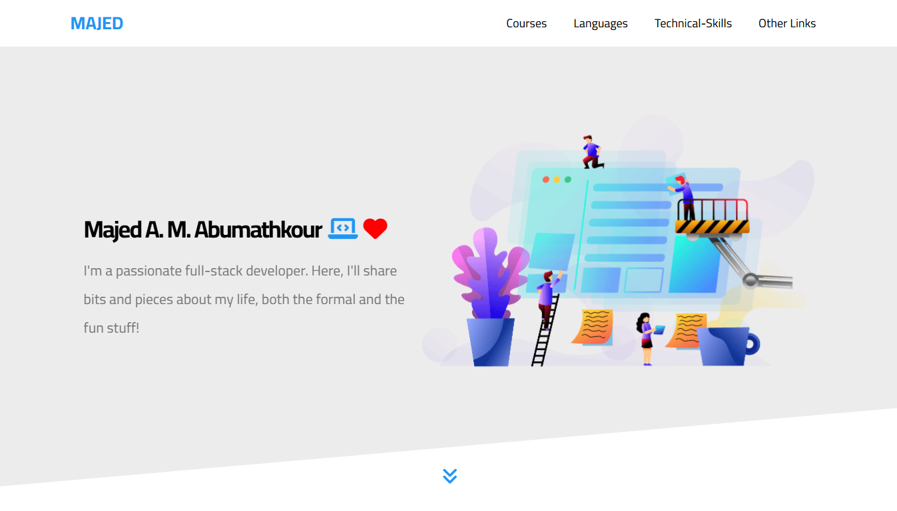

# 💻 Majed A. M. Abumathkour – Personal Portfolio Website

A responsive, one-page personal portfolio website built with **HTML** and **CSS** (JavaScript to be added soon).

This project is inspired by the amazing work of [Osama Elzero](https://elzero.org/).

To build this template:

> 🔗 [The Template Playlist](#https://www.youtube.com/playlist?list=PLDoPjvoNmBAxuCSp2_-9LurPqRVwketnc)

For other Templates:

> 🔗 [Elzero Web School Channel](https://www.youtube.com/@ElzeroWebSchool)

To download or view the source code and materials used, visit:

- 🔗 [My Own Materials](https://github.com/Majed-Abumathkour/template-three)
- 📁 [Original Materials](https://github.com/ElzeroWebSchool/HTML_And_CSS_Template_Three)

---

## 📸 Screenshots

---

## 🖥️ Live Demos

The original live Demo:

My live Demo:

---

## 🚀 Features

- 🔥 Fully responsive design
- 💬 Interactive testimonials section
- 🎯 Clean and modern layout
- 🧭 Smooth navigation experience
- 🌐 Accessible structure
- 🛠️ Organized codebase

---

## 🧰 Technologies Used

- **HTML5**
- **CSS3**
- **JavaScript** _(Coming Soon)_

---

## 📄 License & Credits

Special thanks to **Osama Elzero** for the design inspiration.  

As mentioned in [this video](https://www.youtube.com/watch?reload=9&v=S2EYoJAItsM&list=PLDoPjvoNmBAxuCSp2_-9LurPqRVwketnc&index=34):
- Free for personal and commercial use
- Addable to personal portfolios
- Keep the identity of the original design
- No licensing concerns

Also, special thanks to **Abed-Alrahman Alkawalda** for supporting and contributing to this project.

---

## 👨‍💻 Author

**Majed A. M. Abumathkour**  
🎓 Computer Science Student  
💻 Aspiring Full-Stack Web Developer

---

## 📬 Connect with Me

> I'd love your feedback! Let me know how I can improve the website.

- 
- 
- 
- 
- 
- 

---

## 🚧 Work in Progress

Here are the features and bugs I'm still working on:

- Improve **site performance**
- Enhance **accessibility**
- Replace landing image with **personal image + animation**
- Add missing link in **Nassouhy Challenge**
- Add JavaScript functionality to **shuffle certificates**
- Fix **Quizlet Contributions** data
- Add links in **Favorite Games**
- Make **PES Career** section dynamic with JavaScript
- Connect backend for **Join Us** email submission
- Improve testimonials, especially for **Karim** and **Abed Goal**

---

Thank you for visiting! 🚀  
Feel free to fork the repository and build on top of it!
